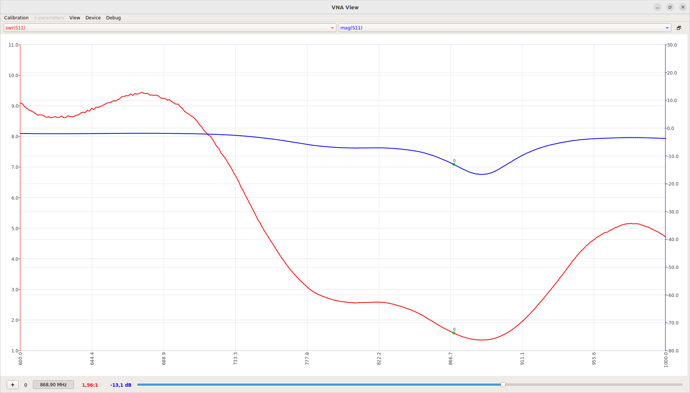

## Quadrifilar Helix Antenna for 868 MHz
Quadrifilar Helix Antenna is the hemispherical circularly polarized antenna. Its ability to directionally receive or transmit circularly polarized radiation while minimizing unwanted radiation perfectly fits especially for satellite communication. This 3D model helps to achieve the correct shape of antenna segments which has a crucial effect on correct circular polarization and antenna tuning.

The antenna structure is made from 2 pcs of 0.8mm silver-plated copper wire, with a total length of 357 mm and 339.4 mm. The wire is held in PLA printed model. Both antenna loops end on the [QFHBAL01 PCB](https://github.com/ODZ-UJF-AV-CR/QFHBAL01). where is soldered. 

# Antenna feed-point

The connection point to the antenna is created by the [antenna balun](https://github.com/ODZ-UJF-AV-CR/QFHBAL01). That solution allows easy use of an RG174 coaxial cable with MCX or optionally SMA connector.

# Antenna Frequency characteristic

Calculated in:
http://jcoppens.com/ant/qfh/calc.en.php

<b>Warning. The 3D model adds parasitic capacity to the antenna which moves resonant frequency. This was corrected by calculating the antenna for a higher frequency (913 MHz). Changing any parameter must be verified by measurement.</b>

For an explanation of the parameters refer to [this page](https://uuki.kapsi.fi/qha_simul.html).

